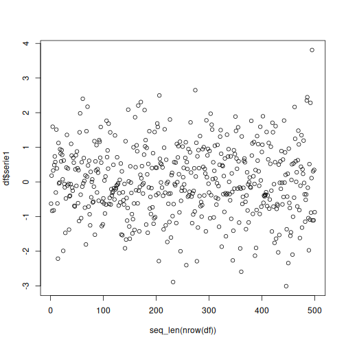
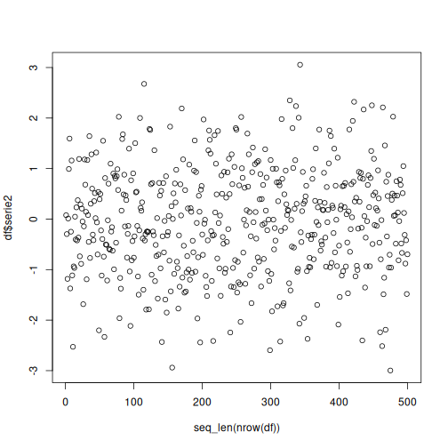
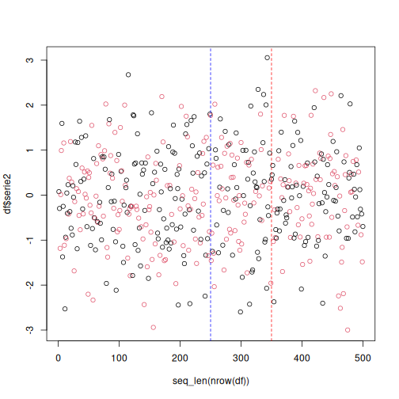

# DDM Example

DDM monitors the online error rate of a predictive process under the assumption that a stable model should keep its error under control over time. Because it operates on model errors, it is a detector of **real concept drift**.

Reference: Gama, J., Medas, P., Castillo, G., and Rodrigues, P. P. (2004). *Learning with drift detection*. SBIA. <doi:10.1007/978-3-540-28645-5_29>

## Learning goal

This example is a compact template for online prediction with error-based drift monitoring with Heimdall.


``` r
# Load Heimdall and the built-in synthetic data stream.
library(heimdall)
```


``` r
# Fix the seed to make the example reproducible.
seed <- 1
set.seed(seed)
```


``` r
# Load the univariate stream and derive the binary monitored signal.
data(st_drift_examples)
df <- st_drift_examples$mv_real_drift
```


``` r
# Plot the binary stream monitored by DDM.
plot(x=seq_len(nrow(df)), y=df$serie1)
```



``` r
plot(x=seq_len(nrow(df)), y=df$serie2)
```




``` r
# Define features
features <- c('serie1', 'serie2')

## Force Target as Factor
target <- 'target'
df[paste0(target)] <- factor(df[[target]])
slevels <- levels(df[[target]])

# Objects used to aggregate explainability data
results <- c()
norm_df <- c()
drift_input_df <- c()
hist_proj <- c()
recent_proj <- c()

# Model threshold
th <- 0.5

# Define batches
batch_size <- 50
batch_index <- c()
for(c in (1:(as.integer(nrow(df)/batch_size)))){
  batch_index <- cbind(batch_index, as.vector(rep(c, batch_size)))
}
df <- head(df, length(as.vector(batch_index)))
df['batch_index'] <- as.vector(batch_index)
ordered_batches <- sort(unique(df$batch_index))
old_start_batch <- ordered_batches[1]
# Simulation parameters
warmup_size <- batch_size * 2 # 
monitoring_step <- batch_size # Process data in batch_size frequency
# Define the stealthy model
model <- stealthy(
  model=daltoolbox::cla_dtree(target, slevels), # Naive Bayes Classifier
  drift_method=dfr_ddm(min_instances = batch_size, out_control_level = 5), # Using DDM
  norm_class=nrm_memory(norm_class = daltoolbox::minmax()), # Normalization with MinMax
  warmup_size=warmup_size, # Warmup size used to train models
  incremental_memory=FALSE, # Do not force retrain in each batch
  class_balance='inactive', # No class balancing
  target_uni_drifter=FALSE, # Uses each features individually
  active_warmup = FALSE, # Only trains when warmup_size rows are available
  verbose=TRUE # Shows status messages
)
```


``` r
 # Simulation
start_time <- Sys.time()
for (batch in ordered_batches[2:length(ordered_batches)]){
  start_batch_time <- Sys.time()
  
  print(paste0('Time Step:', batch))
  
  # Define batches
  new_batch <- df[df$batch_index == batch,]
  last_batch <- df[(df$batch_index < batch) & (df$batch_index >= old_start_batch),]
  old_start_batch <- batch
  
  # Define Training Data
  x_train <- last_batch[, features]
  y_train <- last_batch[, target, drop=FALSE]
  
  # Define Test Data
  x_test <- new_batch[, features]
  y_test <- new_batch[, target]
  
  model <- daltoolbox::fit(model, x_train, y_train)
  
  # If there is a model, predict and calculate metrics
  if(model$fitted){
    test_predictions <- predict(model, x_test)
    y_pred <- factor(test_predictions[, 2] > th)
    levels(y_pred) <- slevels
    
    # Metrics calculation
    y_pred <- as.numeric(y_pred)
    y_test <- as.numeric(y_test)

    true_positives <- sum((y_pred == 2) & (y_test == 2))
    false_positives <- sum((y_pred == 2) & (y_test == 1))
    true_negatives <- sum((y_pred == 1) & (y_test == 1))
    false_negatives <- sum((y_pred == 1) & (y_test == 2))
  }else{
    true_positives <- 0
    false_positives <- 0
    true_negatives <- 0
    false_negatives <- 0
  }
  
  elap_batch_time <- Sys.time() - start_batch_time
  
  # Aggregate results
  results <- rbind(results, 
                   c(
                     batch,
                     true_positives,
                     false_positives,
                     true_negatives,
                     false_negatives,
                     model$drifted,
                     elap_batch_time
                   )
  )
  
}
```

```
## [1] "Time Step:2"
## [1] "Time Step:3"
## [1] "Time Step:4"
## [1] "Time Step:5"
## [1] "Time Step:6"
## [1] "Time Step:7"
```

```
## Stealthy detected a drift, discarding old data
```

```
## [1] "Time Step:8"
## [1] "Time Step:9"
## [1] "Time Step:10"
```

``` r
results<- as.data.frame(results)
names(results) <- c('Batch Index', 'tp', 'fp', 'tn', 'fn', 'drifted', 'elap')
```


``` r
# Print the positions where DDM detected drift.
results
```

```
##   Batch Index tp fp tn fn drifted        elap
## 1           2  0  0  0  0       0 0.000811100
## 2           3 20  0 26  4       0 0.006047487
## 3           4 20  0 29  1       0 0.003081083
## 4           5 20  3 23  4       0 0.003301382
## 5           6  2 18  1 29       0 0.003124475
## 6           7  0  0  0  0       1 0.002440453
## 7           8 18  4 25  3       0 0.005643129
## 8           9 21  4 17  8       0 0.003038883
## 9          10 20  1 25  4       0 0.003316164
```


``` r
# Calculate metrics
beta <- 1
tp_sum <- sum(results['tp'])
fp_sum <- sum(results['fp'])
tn_sum <- sum(results['tn'])
fn_sum <- sum(results['fn'])
precision <- tp_sum/(tp_sum + fp_sum)
recall <- tp_sum/(tp_sum + fn_sum)
accuracy <- (tp_sum + tn_sum)/(tp_sum + fp_sum + tn_sum + fn_sum)
f1 <- 2 * (precision * recall) / (((beta^2)*precision) + recall)

print(paste('Precision', precision, 'Recall', recall, 'F1', f1, 'Accuracy', accuracy))
```

```
## [1] "Precision 0.801324503311258 Recall 0.695402298850575 F1 0.744615384615385 Accuracy 0.762857142857143"
```

``` r
plot(x=seq_len(nrow(df)), y=df$serie2, col=as.numeric(df[[target]]))
abline(v=250, col='blue', lty=2)
for (drift_index in results[results['drifted'] == 1, 'Batch Index']) {
  abline(v=drift_index*batch_size, col='red', lty=2)
}
```


