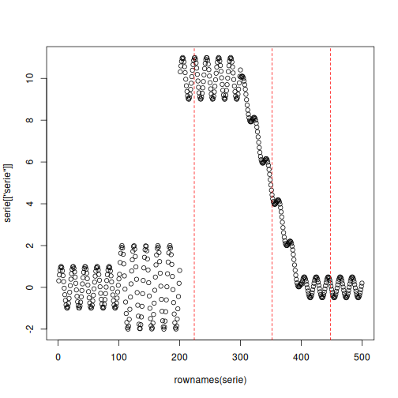

# ADWIN Drifter Example

This example uses an distribuition-based drift detector with a synthetic variable.


``` r
library(daltoolbox)
library(heimdall)
seed <- 1
set.seed(seed)
py_set_seed(seed, disable_hash_randomization = TRUE)
```

## Load Data


``` r
data(st_drift_examples)
serie <- st_drift_examples$univariate
```

### Plot Serie


``` r
plot(x=rownames(serie), y=serie[['serie']])
```


### Instantiate Model


``` r
model <- dfr_adwin(target_feat='serie')
```

## Detection


``` r
detection <- NULL
output <- list(obj=model, drift=FALSE)
for (i in 1:length(serie$serie)){
 output <- update_state(output$obj, serie$serie[i])
 if (output$drift){
   type <- 'drift'
   output$obj <- reset_state(output$obj)
 }else{
   type <- ''
 }
 detection <- rbind(detection, data.frame(idx=i, event=output$drift, type=type))
}
```

## Plot Drifts


``` r
detection[detection$type == 'drift',]
```

```
##     idx event  type
## 224 224  TRUE drift
## 352 352  TRUE drift
## 448 448  TRUE drift
```


``` r
plot(x=rownames(serie), y=serie[['serie']])
for(drift_index in detection[detection$type == 'drift', 'idx']){
  abline(v=drift_index, col='red', lty=2)
}
```


