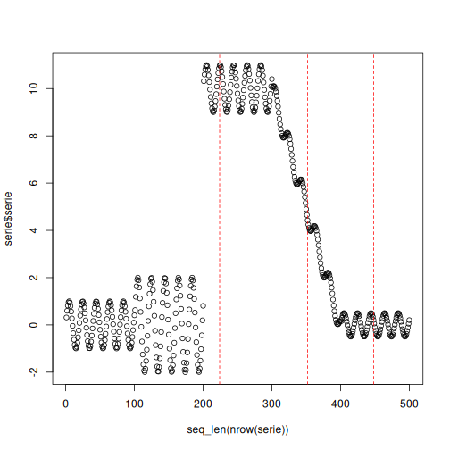

# ADWIN Example

ADWIN (Adaptive Windowing) is a sequential detector that maintains a variable-length window and checks whether old and recent observations still look statistically compatible. It is a strong starting point when you want a general detector for changes in a numeric monitored signal.

In this example, ADWIN is used on a univariate stream, so the interpretation is **virtual concept drift**.

Reference: Bifet, A., and Gavaldà, R. (2007). *Learning from time-changing data with adaptive windowing*. SIAM International Conference on Data Mining. <doi:10.1137/1.9781611972771.42>

## Learning goal

This example is meant to help you understand the standard Heimdall workflow for a distribution-based detector:

1. load a stream;
2. instantiate the detector;
3. update it one observation at a time;
4. store the detected drift points;
5. visualize the alarms on top of the signal.


``` r
# Load Heimdall so the detector and built-in datasets are available.
library(heimdall)
```


``` r
# Fix the seed to keep the example reproducible.
seed <- 1
set.seed(seed)
```


``` r
# Load the synthetic univariate stream used in the walkthrough.
data(st_drift_examples)
serie <- st_drift_examples$univariate
```


``` r
# Plot the monitored variable before starting the sequential updates.
plot(x=seq_len(nrow(serie)), y=serie$serie)
```


``` r
# Instantiate ADWIN to monitor the numeric stream directly.
model <- dfr_adwin(target_feat='serie')
```


``` r
# Run the sequential detection loop and record every drift alarm.
detection <- NULL
output <- list(obj=model, drift=FALSE)
for (i in seq_len(nrow(serie))){
  output <- update_state(output$obj, serie$serie[i])
  if (output$drift){
    type <- 'drift'
    output$obj <- reset_state(output$obj)
  } else {
    type <- ''
  }
  detection <- rbind(detection, data.frame(idx=i, event=output$drift, type=type))
}
```


``` r
# Print the drift positions detected by ADWIN.
detection[detection$type == 'drift',]
```

```
##     idx event  type
## 224 224  TRUE drift
## 352 352  TRUE drift
## 448 448  TRUE drift
```


``` r
# Overlay the detected drifts on the original numeric stream.
plot(x=seq_len(nrow(serie)), y=serie$serie)
for (drift_index in detection[detection$type == 'drift', 'idx']) {
  abline(v=drift_index, col='red', lty=2)
}
```


