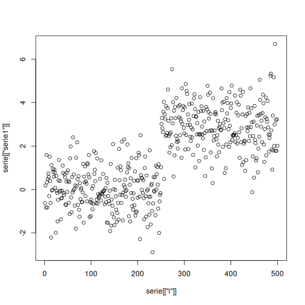
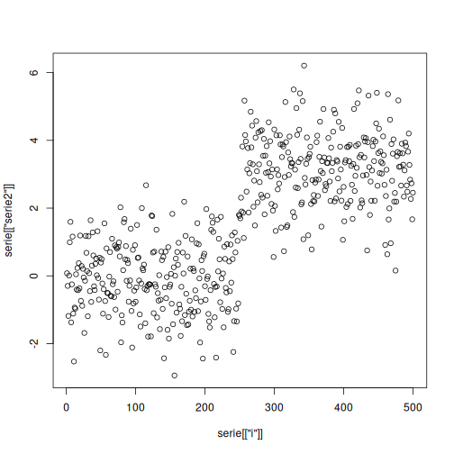

``` r
# Installing heimdall
install.packages("heimdall")
```

```

```


``` r
# Loading heimdall
library(daltoolbox)
library(daltoolboxdp)
library(heimdall) 
```


``` r
# Autoencoder Multivariate Drifter Example
# This example uses a distribuition-based drift detector with a synthetic variable.
seed <- 1
set.seed(seed)
```


``` r
# Load Data

data(st_drift_examples)
serie <- st_drift_examples$dataset2
```


``` r
# Plot Serie

plot(x=serie[['i']], y=serie[['serie1']])
```



``` r
plot(x=serie[['i']], y=serie[['serie2']])
```




``` r
# Instantiate Model

model <- dfr_aedd(encoding_size=1, ae_class=autoenc_ed, batch_size=64, monitoring_step=10, window_size=256)
monitored_features <- c('serie1', 'serie2')
```


``` r
# Detection

detection <- NULL
output <- list(obj=model, drift=FALSE)
for (i in 1:nrow(serie)){
 output <- update_state(output$obj, serie[i, monitored_features])
 if (output$drift){
   type <- 'drift'
   output$obj <- reset_state(output$obj)
 }else{
   type <- ''
 }
 detection <- rbind(detection, data.frame(idx=i, event=output$drift, type=type))
}
```

```
## [1] "Fitting Autoencoder"
```


``` r
# Plot Drifts

detection[detection$type == 'drift',]
```

```
## [1] idx   event type 
## <0 rows> (or 0-length row.names)
```


``` r
plot(x=serie[['i']], y=serie[['serie2']])
```


``` r
for(drift_index in detection[detection$type == 'drift', 'idx']){
  abline(v=drift_index, col='red', lty=2)
}
```
