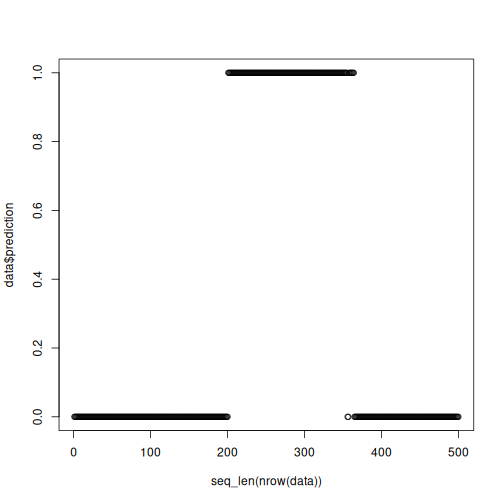
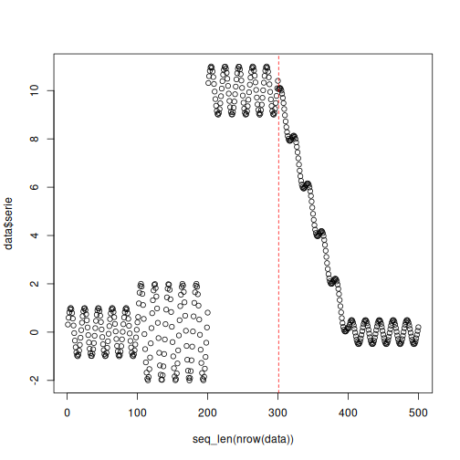

# CUSUM Example

CUSUM is a sequential detector that accumulates evidence of persistent deviation. In model monitoring, it is naturally applied to a binary error stream, making it a practical detector for **real concept drift**.

Reference: Muthukrishnan, S., Berg, E., and Wu, Y. (2007). *Sequential change detection on data streams*. IEEE ICDMW. <doi:10.1109/ICDMW.2007.89>

## Learning goal

This example shows how to turn a simple prediction rule into a binary monitored signal and feed that signal into a detector that focuses on performance changes.


``` r
# Load Heimdall and the synthetic benchmark stream.
library(heimdall)
```


``` r
# Fix the seed for reproducibility.
seed <- 1
set.seed(seed)
```


``` r
# Load the stream and derive a simple binary error-like signal.
data(st_drift_examples)
data <- st_drift_examples$univariate
data$prediction <- st_drift_examples$univariate$serie > 4
```


``` r
# Plot the binary monitored stream used by CUSUM.
plot(x=seq_len(nrow(data)), y=data$prediction)
```




``` r
# Instantiate the CUSUM detector.
model <- dfr_cusum()
```


``` r
# Update the detector sequentially over the binary stream.
detection <- NULL
output <- list(obj=model, drift=FALSE)
for (i in seq_len(nrow(data))){
  output <- update_state(output$obj, data$prediction[i])
  if (output$drift){
    type <- 'drift'
    output$obj <- reset_state(output$obj)
  } else {
    type <- ''
  }
  detection <- rbind(detection, data.frame(idx=i, event=output$drift, type=type))
}
```


``` r
# Print the drift alarms produced by the detector.
detection[detection$type == 'drift',]
```

```
##     idx event  type
## 301 301  TRUE drift
```


``` r
# Map the drift alarms back onto the original numeric series.
plot(x=seq_len(nrow(data)), y=data$serie)
for (drift_index in detection[detection$type == 'drift', 'idx']) {
  abline(v=drift_index, col='red', lty=2)
}
```


