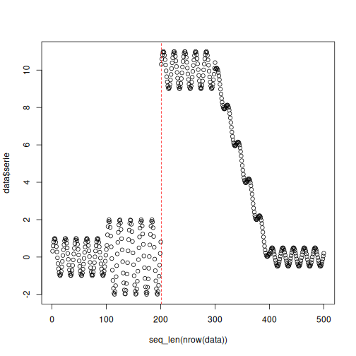

# ECDD Example

ECDD adapts an EWMA control chart to concept drift detection by smoothing the online error stream and checking whether it departs from its expected range. Because it monitors performance-related signals, it is aimed at **real concept drift**.

Reference: Ross, G. J., Adams, N. M., Tasoulis, D. K., and Hand, D. J. (2012). *Exponentially weighted moving average charts for detecting concept drift*. Pattern Recognition Letters, 33(2), 191-198. <doi:10.1016/j.patrec.2011.08.019>

## Learning goal

This example is useful if you want to learn how a smoother, control-chart-style detector can be used inside the standard Heimdall streaming loop.


``` r
# Load Heimdall and the synthetic example stream.
library(heimdall)
```


``` r
# Fix the seed for reproducibility.
seed <- 1
set.seed(seed)
```


``` r
# Load the stream and derive the binary monitored signal.
data(st_drift_examples)
data <- st_drift_examples$univariate
data$prediction <- st_drift_examples$univariate$serie > 4
```


``` r
# Plot the binary stream that ECDD will monitor.
plot(x=seq_len(nrow(data)), y=data$prediction)
```


``` r
# Instantiate the ECDD detector.
model <- dfr_ecdd()
```


``` r
# Update the detector sequentially and store the detected alarms.
detection <- NULL
output <- list(obj=model, drift=FALSE)
for (i in seq_len(nrow(data))){
  output <- update_state(output$obj, data$prediction[i])
  if (output$drift){
    type <- 'drift'
    output$obj <- reset_state(output$obj)
  } else {
    type <- ''
  }
  detection <- rbind(detection, data.frame(idx=i, event=output$drift, type=type))
}
```


``` r
# Print the drift points signaled by ECDD.
detection[detection$type == 'drift',]
```

```
##     idx event  type
## 201 201  TRUE drift
```


``` r
# Overlay the alarms on the original numeric signal.
plot(x=seq_len(nrow(data)), y=data$serie)
for (drift_index in detection[detection$type == 'drift', 'idx']) {
  abline(v=drift_index, col='red', lty=2)
}
```


