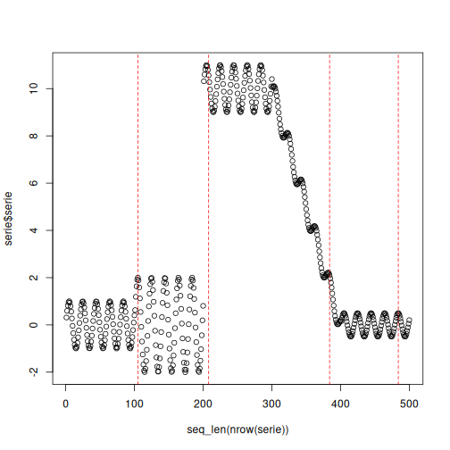

# KLDIST Example

This detector compares historical and recent windows through the Kullback-Leibler divergence. It is a direct way to monitor whether the observed distribution itself is changing over time.

In this example, KLDIST is used for **virtual concept drift** detection.

Reference: Kullback, S., and Leibler, R. A. (1951). *On information and sufficiency*. The Annals of Mathematical Statistics, 22(1), 79-86. <doi:10.1214/aoms/1177729694>

## Learning goal

This example is useful for users who want a distribution-comparison detector with a simple streaming interface.


``` r
# Load Heimdall and the example data stream.
library(heimdall)
```


``` r
# Fix the seed to keep the example reproducible.
seed <- 1
set.seed(seed)
```


``` r
# Load the univariate stream monitored in this walkthrough.
data(st_drift_examples)
serie <- st_drift_examples$univariate
```


``` r
# Plot the monitored numeric signal before detection.
plot(x=seq_len(nrow(serie)), y=serie$serie)
```


``` r
# Instantiate the KL-divergence-based detector.
model <- dfr_kldist(target_feat='serie', window_size=100)
```


``` r
# Update the detector sequentially and store drift alarms.
detection <- NULL
output <- list(obj=model, drift=FALSE)
for (i in seq_len(nrow(serie))){
  output <- update_state(output$obj, serie$serie[i])
  if (output$drift){
    type <- 'drift'
    output$obj <- reset_state(output$obj)
  } else {
    type <- ''
  }
  detection <- rbind(detection, data.frame(idx=i, event=output$drift, type=type))
}
```


``` r
# Print the points where KLDIST detected drift.
detection[detection$type == 'drift',]
```

```
##     idx event  type
## 101 101  TRUE drift
## 152 152  TRUE drift
## 203 203  TRUE drift
## 254 254  TRUE drift
## 305 305  TRUE drift
## 356 356  TRUE drift
## 407 407  TRUE drift
## 458 458  TRUE drift
```


``` r
# Overlay the detected drifts on the original numeric stream.
plot(x=seq_len(nrow(serie)), y=serie$serie)
for (drift_index in detection[detection$type == 'drift', 'idx']) {
  abline(v=drift_index, col='red', lty=2)
}
```


