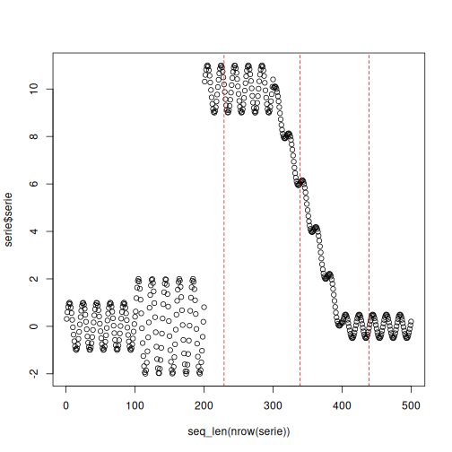

``` r
# Loading heimdall
library(heimdall)
```


``` r
# KSWIN example
# KSWIN is shown here as a virtual concept drift detector over a numeric stream.
seed <- 1
set.seed(seed)
```


``` r
# Load data

data(st_drift_examples)
serie <- st_drift_examples$univariate
```


``` r
# Plot series

plot(x=seq_len(nrow(serie)), y=serie$serie)
```


``` r
# Instantiate model

model <- dfr_kswin(target_feat='serie', window_size=100, stat_size=50)
```


``` r
# Detection

detection <- NULL
output <- list(obj=model, drift=FALSE)
for (i in seq_len(nrow(serie))){
  output <- update_state(output$obj, serie$serie[i])
  if (output$drift){
    type <- 'drift'
    output$obj <- reset_state(output$obj)
  } else {
    type <- ''
  }
  detection <- rbind(detection, data.frame(idx=i, event=output$drift, type=type))
}
```


``` r
# Detected drifts

detection[detection$type == 'drift',]
```

```
##     idx event  type
## 229 229  TRUE drift
## 339 339  TRUE drift
## 439 439  TRUE drift
```


``` r
# Plot drifts

plot(x=seq_len(nrow(serie)), y=serie$serie)
for (drift_index in detection[detection$type == 'drift', 'idx']) {
  abline(v=drift_index, col='red', lty=2)
}
```


