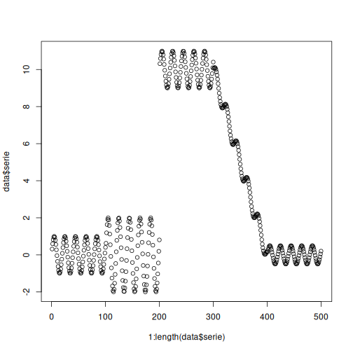
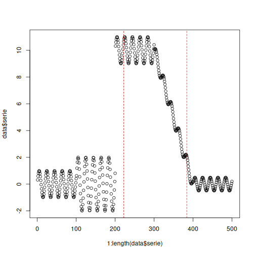

``` r
# Installing heimdall
install.packages("heimdall")
```

```

```


``` r
# Loading heimdall
library(daltoolbox)
library(heimdall) 
```


``` r
# KSWIN Drifter Example
# This example uses a distribuition-based drift detector with a synthetic variable.

seed <- 1
set.seed(seed)
```


``` r
# Load Data

data(st_drift_examples)
data <- st_drift_examples$univariate
data$event <- NULL
data$prediction <- st_drift_examples$univariate$serie > 4
```


``` r
# Plot Serie

plot(x=1:length(data$serie), y=data$serie)
```




``` r
# Instantiate Model

model <- dfr_kswin(target_feat='serie', window_size=100, stat_size=50)
```


``` r
# Detection

detection <- NULL
output <- list(obj=model, drift=FALSE)
for (i in 1:length(data$prediction)){
 output <- update_state(output$obj, data$prediction[i])
 if (output$drift){
   type <- 'drift'
   output$obj <- reset_state(output$obj)
 }else{
   type <- ''
 }
 detection <- rbind(detection, data.frame(idx=i, event=output$drift, type=type))
}
```


``` r
# Plot Drifts

detection[detection$type == 'drift',]
```

```
##     idx event  type
## 222 222  TRUE drift
## 384 384  TRUE drift
```


``` r
plot(x=1:length(data$serie), y=data$serie)
for(drift_index in detection[detection$type == 'drift', 'idx']){
  abline(v=drift_index, col='red', lty=2)
}
```


