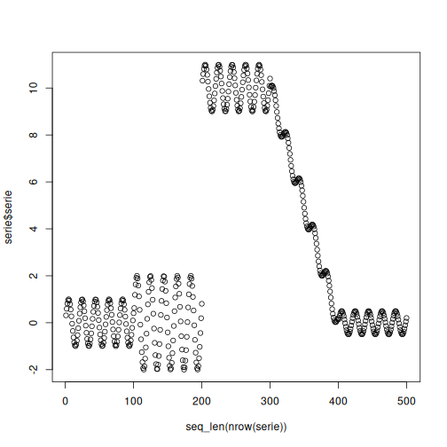
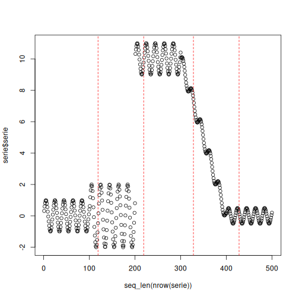

# LBDD Example

LBDD compares the variability of historical and recent windows using Levene's test. It is useful when the most relevant change is not the average level of the signal, but its dispersion.

In this example, LBDD is used for **virtual concept drift** detection.

Reference: Giusti, L., Carvalho, L., Gomes, A. T., Coutinho, R., Soares, J., and Ogasawara, E. (2021). *Analysing flight delay under concept drift*. Evolving Systems. <doi:10.1007/s12530-021-09415-z>

## Learning goal

This example is intended to show how a variance-oriented detector can be used in the same streaming workflow as the other Heimdall methods.


``` r
# Load Heimdall and the synthetic univariate stream.
library(heimdall)
```


``` r
# Fix the seed for reproducibility.
seed <- 1
set.seed(seed)
```


``` r
# Load the numeric stream monitored by the detector.
data(st_drift_examples)
serie <- st_drift_examples$univariate
```


``` r
# Plot the series before starting drift detection.
plot(x=seq_len(nrow(serie)), y=serie$serie)
```




``` r
# Instantiate the Levene-based detector.
model <- dfr_lbdd(target_feat='serie', window_size=100)
```


``` r
# Update the detector over the stream and record each drift alarm.
detection <- NULL
output <- list(obj=model, drift=FALSE)
for (i in seq_len(nrow(serie))){
  output <- update_state(output$obj, serie$serie[i])
  if (output$drift){
    type <- 'drift'
    output$obj <- reset_state(output$obj)
  } else {
    type <- ''
  }
  detection <- rbind(detection, data.frame(idx=i, event=output$drift, type=type))
}
```


``` r
# Print the positions where LBDD detected drift.
detection[detection$type == 'drift',]
```

```
##     idx event  type
## 119 119  TRUE drift
## 219 219  TRUE drift
## 328 328  TRUE drift
## 428 428  TRUE drift
```


``` r
# Overlay those drift points on the original numeric stream.
plot(x=seq_len(nrow(serie)), y=serie$serie)
for (drift_index in detection[detection$type == 'drift', 'idx']) {
  abline(v=drift_index, col='red', lty=2)
}
```


